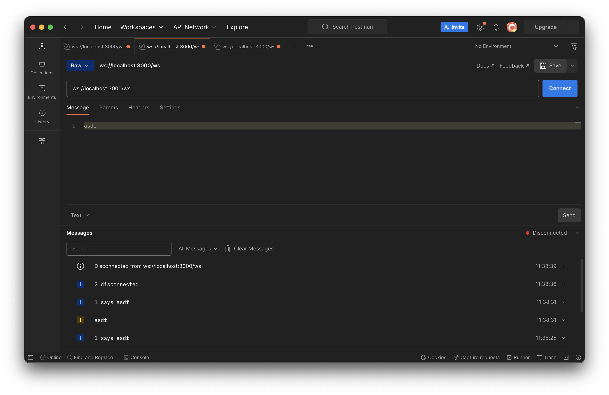

# A group echo chamber using WebSockets

1. Join `ws://localhost:3000/ws` --- from multiple concurrent clients, if you wish.
2. Say stuff, everyone will hear it.
3. Have fun, but don't send binary messages.

"Testing using Postman"

## How to run

1. Have port 3000 open.
2. `cargo run`
